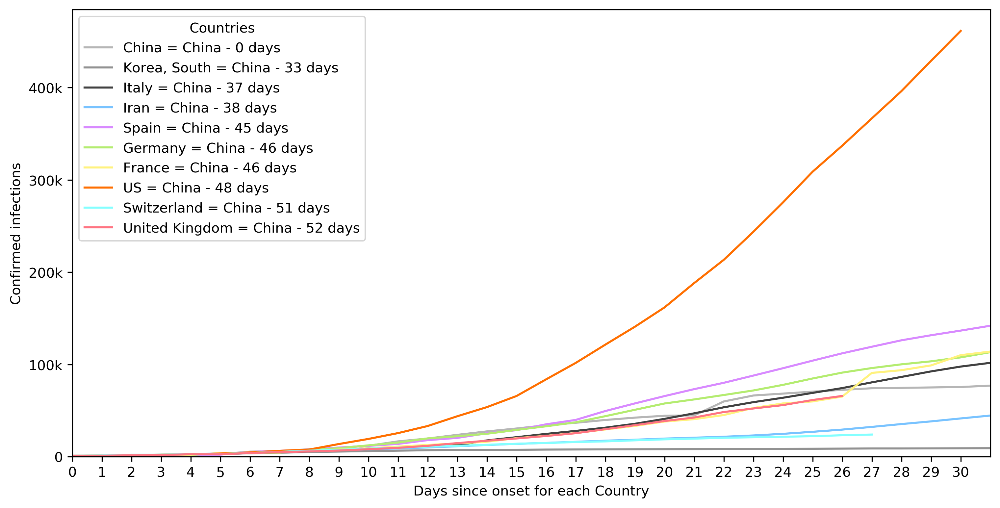

# COVID-19 analysis

Growth rate of confirmed infections (as of 3/16/2020)

Data from https://github.com/CSSEGISandData/COVID-19

## Initial project setup

1. If necessary, install [conda or miniconda](https://docs.conda.io/projects/conda/en/latest/user-guide/install/index.html)
2. Clone the repo
3. From a terminal shell, run `conda env create --file environment.yml`, then `conda activate cms-ai`
4. Create a `data\raw` folder and move the unencrypted CMS data to it.
5. Some of the data processing scripts are written in javascript, so make sure you have npm and node ≥ 12 installed. Then run `npm` from the main folder to install the dependencies.

## Updating dependencies

1. To update your local environment dependencies to match the `environment.yml` file, run `conda env update --file environment.yml --prune`

## Installing new dependencies

1. Add new package(s) to the `environment.yml` file and then run `conda env update --file environment.yml --prune`.
2. To list outdated packages, run `conda update --all`, which will show a list of packages that will be updated. Reply `N` to just see the list. Manually update any dependencies by editing the `environment.yml` file and then running `conda env update --file environment.yml --prune`.
