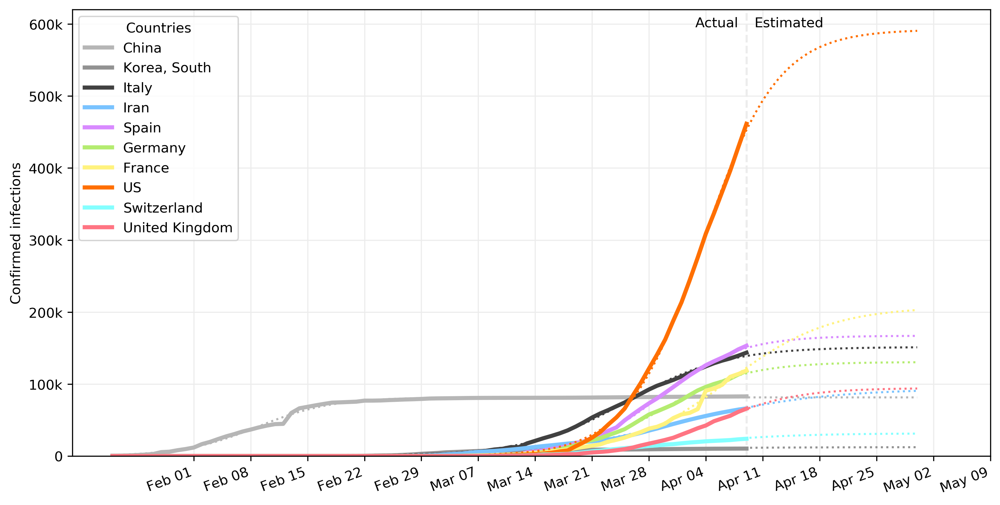
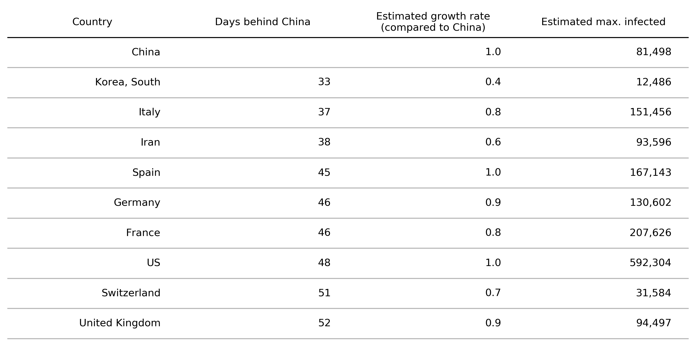

# COVID-19 analysis

Confirmed infections over time

Model estimates of confirmed infections over time

Summary by country

**Notes**

- Data is from <https://github.com/CSSEGISandData/COVID-19>
- Model predictions are based on the best-fit sigmoidal model for each country:
    

    where  are fit from the existing data.

## Initial project setup

1. If necessary, install [conda or miniconda](https://docs.conda.io/projects/conda/en/latest/user-guide/install/index.html)
2. Clone the repo
3. From a terminal shell, run `conda env create --file environment.yml`, then `conda activate cms-ai`

## Updating dependencies

1. To update your local environment dependencies to match the `environment.yml` file, run `conda env update --file environment.yml --prune`

## Installing new dependencies

1. Add new package(s) to the `environment.yml` file and then run `conda env update --file environment.yml --prune`.
2. To list outdated packages, run `conda update --all`, which will show a list of packages that will be updated. Reply `N` to just see the list. Manually update any dependencies by editing the `environment.yml` file and then running `conda env update --file environment.yml --prune`.
